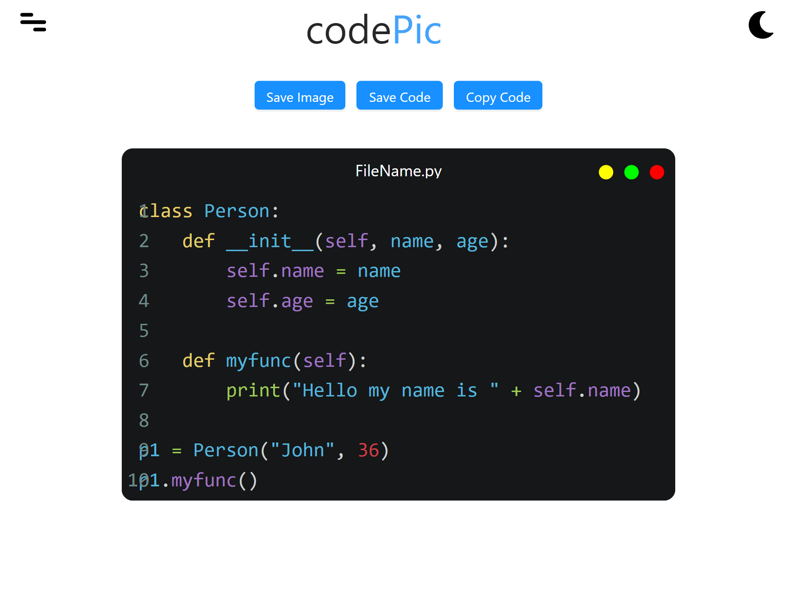

# [codePic](https://ShreyasDalwalegithub.io/codePic)
>Turn your code into awesome pictures ready to be shared with the world

## Features
- In-built Code Editor
- Supports More than 100 Programming Languages
- Npm not needed
- Works on static server
- 62 Material Designed Custom Themes

## Open Source Projects used
- [CodeMirror](https://github.com/codemirror/CodeMirror)
- [Halfmoon](https://github.com/halfmoonui/halfmoon) 
- [html2canvas](https://github.com/niklasvh/html2canvas)
- [FileSaver](https://github.com/eligrey/FileSaver.js/) 
